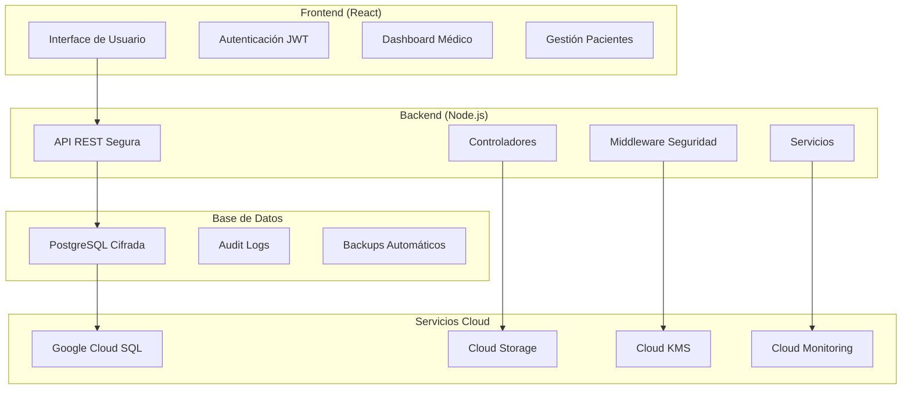

# 🏥 Sistema de Historias Clínicas Seguro

[](https://opensource.org/licenses/MIT)
[](https://nodejs.org/)
[](https://reactjs.org/)
[](https://www.typescriptlang.org/)
[](https://www.docker.com/)
[](https://kubernetes.io/)

Sistema completo de gestión de historias clínicas con estándares de seguridad médica, cumplimiento normativo HIPAA/GDPR y arquitectura cloud-native para Google Cloud Platform.

## ✨ Características Principales

### 🔐 Seguridad Médica de Nivel Empresarial
- **Autenticación Multi-Rol**: Médicos, Enfermeras, Administradores y Pacientes
- **Cifrado AES-256**: Protección de datos sensibles en reposo y tránsito
- **Auditoría Completa**: Registro detallado de todas las acciones del sistema
- **Firma Digital**: Validación criptográfica de documentos médicos
- **Cumplimiento Normativo**: HIPAA, GDPR, Ley 1581/2012 (Colombia)

### 🏥 Funcionalidades Médicas
- **Gestión Completa de Pacientes**: Registro, edición y consulta de historias
- **Formularios Médicos Inteligentes**: Validación automática y campos requeridos
- **Exportación PDF**: Generación segura de reportes y documentos
- **IA Médica**: Asistente powered by Google Gemini para apoyo diagnóstico
- **Dashboard Analítico**: Métricas y estadísticas de la práctica médica

### ☁️ Arquitectura Cloud-Native
- **Containerización Docker**: Despliegue consistente y escalable
- **Kubernetes Ready**: Manifiestos para GKE con autoscaling
- **Cloud SQL**: Base de datos PostgreSQL administrada
- **Load Balancing**: Distribución automática de carga
- **Backup Automático**: Protección de datos críticos

## 🚀 Inicio Rápido

### Prerequisitos
- Node.js 18+
- Docker (opcional)
- Cuenta de Google Cloud Platform (para producción)

### Instalación Local

```bash
# Clonar el repositorio
git clone https://github.com/desarrolloIngenios/historia-clinicas.git
cd historia-clinicas

# Instalar dependencias
npm install

# Configurar variables de entorno
cp .env.example .env
# Editar .env con tus configuraciones

# Iniciar en modo desarrollo
npm run dev
```

### Acceso Demo
- **URL**: `http://localhost:3000`
- **Usuario Demo**: `admin@clinica.com`
- **Contraseña**: `Admin123!`

## 🏗️ Arquitectura del Sistema



## 🔧 Despliegue en Producción

### Google Cloud Platform (GKE)

```bash
# Navegar al directorio de despliegue
cd gcp-deployment

# Configurar proyecto GCP
export PROJECT_ID="tu-project-id"
make setup

# Desplegar aplicación completa
make deploy
```

### Docker Compose (Desarrollo)

```bash
# Construir y ejecutar contenedores
docker-compose up --build

# Acceder a la aplicación
open http://localhost:3000
```

## 📋 Variables de Entorno

| Variable | Descripción | Requerida |
|----------|-------------|-----------|
| `VITE_API_URL` | URL de la API backend | ✅ |
| `VITE_GEMINI_API_KEY` | Clave API de Google Gemini | ✅ |
| `DATABASE_URL` | URL de conexión PostgreSQL | ✅ |
| `JWT_SECRET` | Secreto para tokens JWT | ✅ |
| `ENCRYPTION_KEY` | Clave de cifrado AES-256 | ✅ |

## 🧪 Testing

```bash
# Ejecutar tests unitarios
npm run test

# Tests de integración
npm run test:integration

# Tests de seguridad
npm run test:security

# Coverage report
npm run test:coverage
```

## 📊 Monitoreo y Logs

### Métricas Disponibles
- Tiempo de respuesta de API
- Uso de memoria y CPU
- Número de usuarios activos
- Operaciones de base de datos
- Eventos de seguridad

### Logs de Auditoría
```json
{
  "timestamp": "2025-11-01T10:30:00Z",
  "user": "dr.smith@clinica.com",
  "action": "VIEW_PATIENT_RECORD",
  "resource": "patient:12345",
  "ip": "192.168.1.100",
  "success": true
}
```

## 🔒 Cumplimiento y Seguridad

### Estándares Implementados
- **HIPAA**: Health Insurance Portability and Accountability Act
- **GDPR**: General Data Protection Regulation
- **SOC 2**: Security, Availability, and Confidentiality
- **Ley 1581/2012**: Protección de Datos Personales (Colombia)

### Controles de Seguridad
- ✅ Cifrado en reposo y tránsito
- ✅ Autenticación multifactor
- ✅ Control de acceso basado en roles
- ✅ Audit logs inmutables
- ✅ Backup cifrado automático
- ✅ Detección de intrusiones
- ✅ Escaneo de vulnerabilidades

## 📚 Documentación

- [📖 Guía de Usuario](./docs/user-guide.md)
- [🔧 Guía de Administrador](./docs/admin-guide.md)
- [🚀 Guía de Despliegue](./gcp-deployment/README.md)
- [🔐 Políticas de Seguridad](./docs/security-policies.md)
- [📋 API Reference](./docs/api-reference.md)

## 🤝 Contribución

1. Fork del repositorio
2. Crear branch de feature (`git checkout -b feature/AmazingFeature`)
3. Commit de cambios (`git commit -m 'Add some AmazingFeature'`)
4. Push al branch (`git push origin feature/AmazingFeature`)
5. Abrir Pull Request

### Estándares de Código
- TypeScript strict mode
- ESLint configuración médica
- Prettier para formateo
- Tests obligatorios para features críticas

## 📄 Licencia

Este proyecto está licenciado bajo la Licencia MIT - ver el archivo [LICENSE](LICENSE) para detalles.

## 🏢 Desarrollado por

**Desarrollo Ingenios**
- 🌐 Website: [desarrolloingenios.com](https://desarrolloingenios.com)
- 📧 Email: info@desarrolloingenios.com
- 🐙 GitHub: [@desarrolloIngenios](https://github.com/desarrolloIngenios)

## ⚕️ Disclaimer Médico

Este software es una herramienta de apoyo administrativo y no constituye consejo médico. Siempre consulte con profesionales de la salud calificados para decisiones médicas. El uso de este sistema debe cumplir con todas las regulaciones locales de salud y privacidad.

## 🚨 Soporte

Para soporte técnico o preguntas sobre implementación:

- 📧 **Email**: soporte@desarrolloingenios.com
- 💬 **Discord**: [Servidor de Soporte](https://discord.gg/desarrolloingenios)
- 📋 **Issues**: [GitHub Issues](https://github.com/desarrolloIngenios/historia-clinicas/issues)
- 📞 **Urgencias**: +57 (300) 123-4567

---

<div align="center">

**🏥 Construyendo el futuro de la salud digital 🏥**

Made with ❤️ in Colombia 🇨🇴

</div>